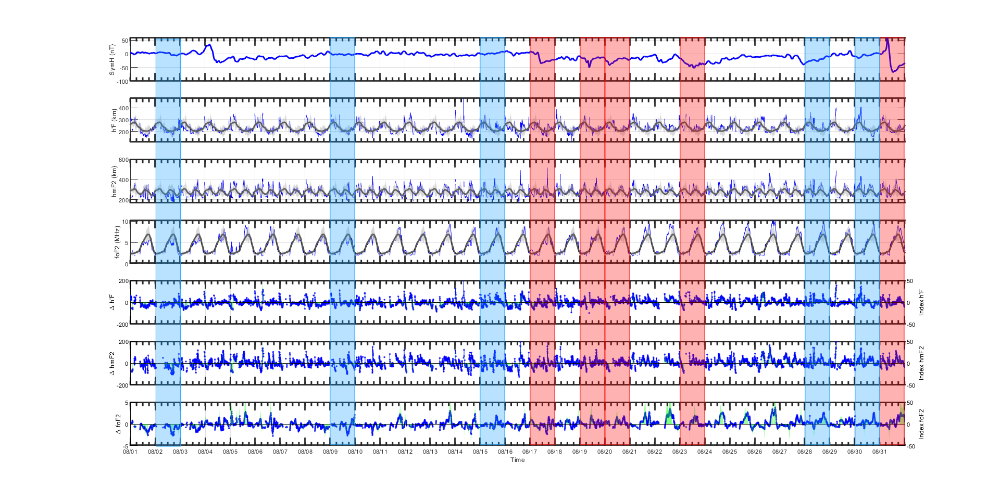
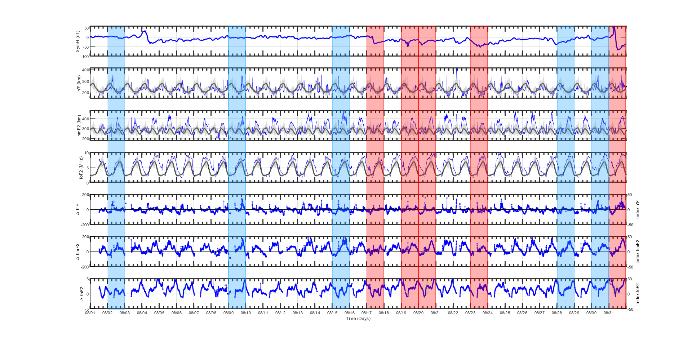
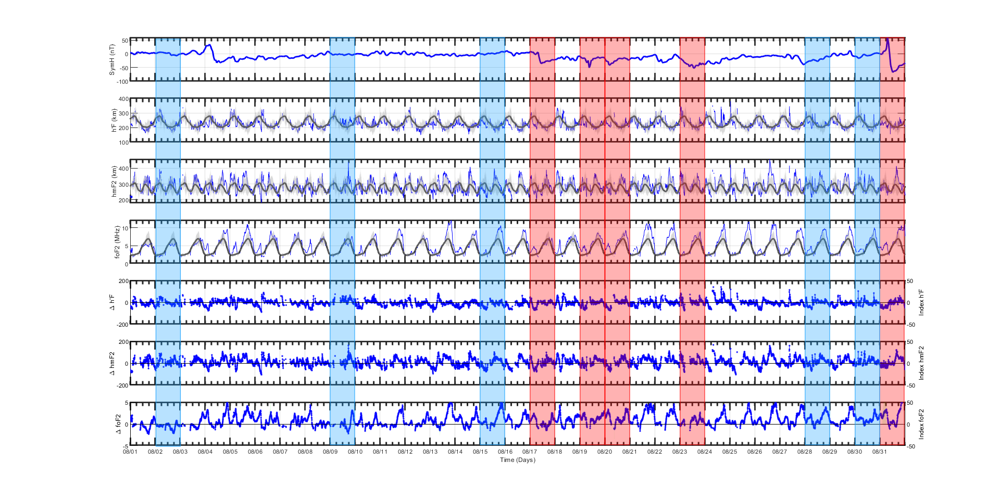

# ☀️ Análise de Dados Ionosféricos (foF2, hmF2 e h'F)

Este é um projeto de **análise de dados ionosféricos** desenvolvido para fins de **pesquisa científica (Iniciação Científica)**. O objetivo principal foi processar, visualizar e comparar parâmetros ionosféricos obtidos a partir de três conjuntos de dados reduzidos em São José dos Campos (SP), Araguatins (TO) e Jataí (GO), no período de **01/08/2017 a 31/08/2017**, junto com dados geofísicos do vento solar e campo magnético interplanetário.

## 🛠 Tecnologias Usadas

- **MATLAB**
- **OMNIWeb: High Resolution OMNI**


## 💡 Objetivo

O projeto visa estudar a **variabilidade ionosférica** com base nos parâmetros:
- **foF2**: Frequência crítica da camada F2
- **hmF2**: Altura máxima da F2
- **h'F**: Altura virtual da camada F

Além disso, os dados são comparados com índices de atividade geomagnética como **Sym-H** e **AE**, e parâmetros do **vento solar** como **Bz** e **Vsw**, identificando possíveis correlações com eventos de tempestades geomagnéticas.

## 📊 Funcionalidades

- 📁 Leitura e agregação de dados de diferentes arquivos `.txt` contendo medidas ionosféricas (estes dados concatenados foram tratados após a redução dos mesmos pelo software UDIDA)
- 🧮 Cálculo de médias e desvios padrão
- 📈 Visualização em gráficos (com bandas de desvio padrão)
- 📉 Cálculo de desvios ponto a ponto em relação à média noturna
- 🟩 Geração de índices normalizados de variação de foF2, h'F e hmF2
- 📦 Identificação de distúrbios e comportamentos anômalos da ionosfera
- 🔴 Destaque visual de eventos geomagnéticos no período estudado (retângulos em vermelho e azul)

## 📂 Estrutura do Projeto

```
analise-ionosferica/
├── dados/
│ ├── dados_juntos_laura_sjc.txt
│ ├── dados_juntos_josy_sjc.txt
│ ├── dados_juntos_gabi_sjc.txt
│ ├── dados_juntos_laura_jat.txt
│ ├── dados_juntos_josy_jat.txt
│ ├── dados_juntos_gabi_jat.txt
│ ├── dados_juntos_laura_arg.txt
│ ├── dados_juntos_josy_arg.txt
│ ├── dados_juntos_gabi_arg.txt
│ └── omni-010817_310817.txt
├── mediasedesvios.mat # Arquivo com médias e desvios por horário
├── codigo_oficial_sjc.m # Script principal de análise para São José dos Campos
├── codigo_oficial_jat.m # Script principal de análise para Jataí
├── codigo_oficial_arg.m # Script principal de análise para Araguatins
├── README.md # Este arquivo
```

## 📦 Como Executar o Projeto

1. Clone o repositório:

```bash
git clone https://github.com/lauratrigo/Analise_Ionosferica_Agosto_2017.git
cd Analise_Ionosferica_Agosto_2017
```
Abra o arquivo codigo_oficial_sjc.m, ou codigo_oficial_jat.m ou codigo_oficial_arg.m no MATLAB.

Certifique-se de que os arquivos .txt e mediasedesvios.mat estão na mesma pasta ou no caminho correto.

Execute o script para gerar os gráficos:

run codigo_oficial_sjc.m, ou codigo_oficial_jat.m ou codigo_oficial_arg.m 

## 🧪 Dados Utilizados

- **foF2, h'F e hmF2**: Medidas observacionais de três pesquisadoras.
- **Índices geofísicos**:
  - `SymH`, `AE`, `Bz`, `Vsw` do banco **OMNIWeb** da NASA.
- **Período analisado**: 01 de agosto de 2017 a 31 de agosto de 2017.

---

## 📈 Gráficos Gerados

- **7 subplots empilhados**:
  1. Sym-H
  2. h'F com banda de desvio
  3. hmF2 com banda de desvio
  4. foF2 com banda de desvio
  5. Índice normalizado de variação de h'F
  6. Índice normalizado de variação de hmF2
  7. Índice normalizado de variação de foF2

### **Destaques visuais**:
- 🔴 **Retângulos vermelhos**: Dias do evento de maior perturbação.
- 🔵 **Retângulos azuis**: Dias geomagneticamente mais calmos.

---

## 🤝 Agradecimentos

Este projeto foi desenvolvido no IP&D (Instituto de Pesquisa e Desenvolvimnto) como parte da Iniciação Científica, com o apoio e orientação do grupo de pesquisa em Física da UNIVAP (Universidade do Vale do Paraíba).

Agradecimentos especiais às colegas **Josy** e **Gabi** pela coleta dos dados manuais e validação dos resultados.

---

## 📜 Licença

Este projeto está licenciado sob a Licença MIT - veja o arquivo LICENSE para mais informações.


<div align="center">
  <h4><strong>Figura 1: São José dos Campos (SP)</strong></h4>
  
</div>

<br>

<div align="center">
  <h4><strong>Figura 2: Araguatins (TO)</strong></h4>
  
</div>

<br>

<div align="center">
  <h4><strong>Figura 3: Jataí (GO)</strong></h4>
  
</div>
